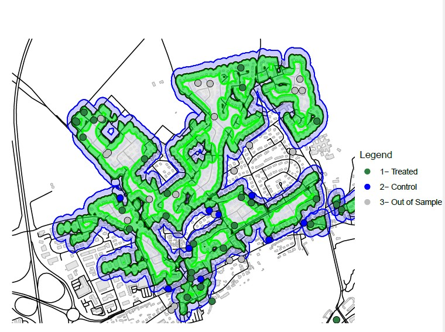

```{r setup, include=FALSE}
knitr::opts_chunk$set(echo = TRUE)
```

## R Markdown

This is an R Markdown document. Markdown is a simple formatting syntax for authoring HTML, PDF, and MS Word documents. For more details on using R Markdown see <http://rmarkdown.rstudio.com>.

When you click the **Knit** button[^1] a document will be generated that includes both content as well as the output of any embedded R code chunks within the document. You can embed an R code chunk like this:

[^1]: Note de bas de page.

```{r cars}
summary(cars)
```

```{r stats desc, echo=FALSE, warning=FALSE, message=FALSE}
min(cars$speed)
max(cars$speed)
```

```{r stats desc 1, include=FALSE, warning=FALSE, message=FALSE}
min_speed <- min(cars$speed)
max_speed <- max(cars$speed)
```

```{r stats desc 2, eval=FALSE, include=TRUE, warning=FALSE, message=FALSE}
min(cars$speed)
max(cars$speed)
```

La vitesse maximale est de `r max_speed` miles per hour, et la vitesse minimale est de `r min_speed` miles per hour.

## Including Plots

You can also embed plots, for example:

```{r pressure, echo=FALSE}
plot(pressure)
```

Note that the `echo = FALSE` parameter was added to the code chunk to prevent printing of the R code that generated the plot.$Y$

$$Y  \beta_1 x_1 + \beta_2 x_2 + \epsilon$$



```{r, echo=FALSE, warning=FALSE, message=FALSE}
library(tidyverse)
co2_raw <- read_csv("data/owid-co2-data.csv")
co2_analysis <- co2_raw %>%
  filter(
    year >= 1990,
    !is.na(iso_code),
    !is.na(co2_per_capita),
    !is.na(population),
    !is.na(gdp),
    population > 0,
    gdp > 0,
    co2_per_capita > 0
  ) %>%
  mutate(
    gdp_per_capita = gdp / population,
    log_gdp_pc = log(gdp_per_capita),
    log_co2_pc = log(co2_per_capita)
  )


desc_table <- co2_analysis %>%
  summarise(
    Observations = n(),
    Pays = n_distinct(country),
    `CO2 moyen par habitant` = mean(co2_per_capita, na.rm = TRUE),
    `PIB moyen par habitant` = mean(gdp_per_capita, na.rm = TRUE)
  )

knitr::kable(desc_table, digits = 2)
```

```{r, message=FALSE, warning=FALSE}
year_stats <- co2_analysis %>% group_by(year) %>% summarise(
mean_co2_pc = mean(co2_per_capita, na.rm = TRUE), median_co2_pc =
median(co2_per_capita, na.rm = TRUE), n_countries = n_distinct(country), .groups = "drop" )

knitr::kable(head(year_stats, 10), digits = 2)
```

```{r graph-distribution, echo=FALSE, fig.width=7, fig.height=4}

ggplot(co2_analysis, aes(x = log_co2_pc)) +
  geom_histogram(bins = 40) +
  theme_minimal() +
  labs(
    title = "Distribution du log des émissions de CO2 par habitant",
    x = "log(CO2 par habitant)",
    y = "Nombre d'observations"
  )

```

```{r graph 2, echo=FALSE, fig.width=7, fig.height=4}

co2_year <- co2_analysis %>% group_by(year) %>% summarise( mean_co2_pc = mean(co2_per_capita, na.rm = TRUE), .groups = "drop" )

ggplot(co2_year, aes(x = year, y = mean_co2_pc)) + geom_line() +
theme_minimal() + labs( title = "Évolution moyenne des émissions de CO2 par habitant", x = 'Année', y = "CO2 par habitant moyen" )


```

## Tableau de régression

```{r, echo=FALSE}
model_1 <- lm(log_co2_pc ~ log_gdp_pc, data = co2_analysis)

summary(model_1)
```

```{r tableau reg, echo=FALSE}
modelsummary::modelsummary(
  model_1,
  stars = TRUE,
  title = "Relation entre PIB par habitant et émissions de CO2"
)
```
